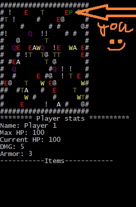

# DwarfDefenseClone
Simple Dwarf Defense Clone console game.

How to build: 

- Just run cmake on CMakeList.txt

How to play:
- You are P(Green)
- Enemies are E(Red)
- Treasure chests are T
- !, @, # are impassable objects (Tree, Water, Mountain)
- W -> Weapons, A -> Armor, Q -> Consumable (HP Potion)
- Enemies are walking randomly. I will add A* pathfinding so they are chasing you. Run into enemies to start a fight.
- Use potion by entering its ordinal number in inventory (Beware, you can enter numbers from 1 to 9, use them wisely :P)
- Levels are generated randomly. Your board is n by m large. It can vary between 10x10 and 40x40.